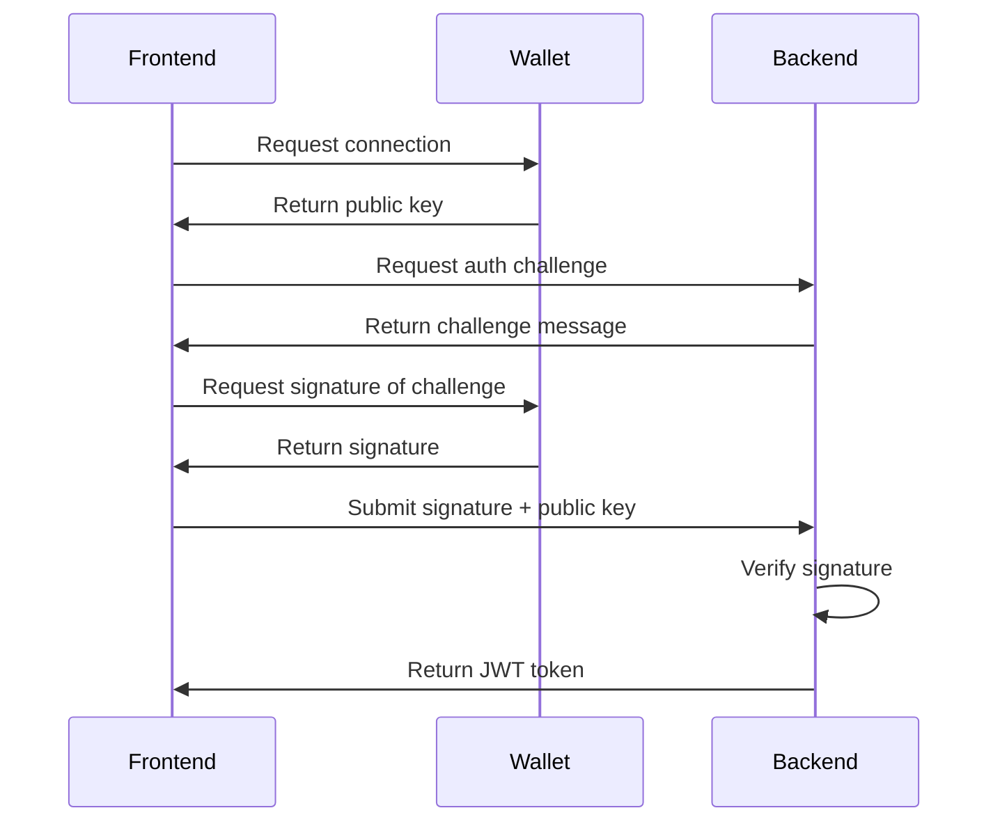
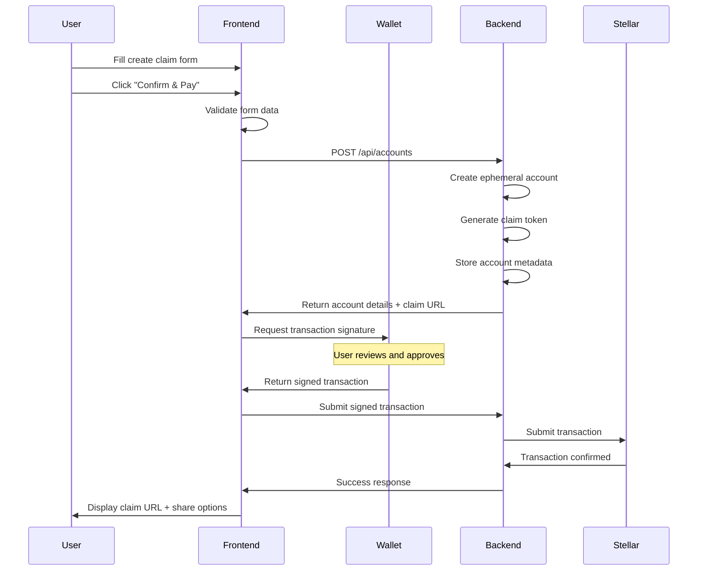
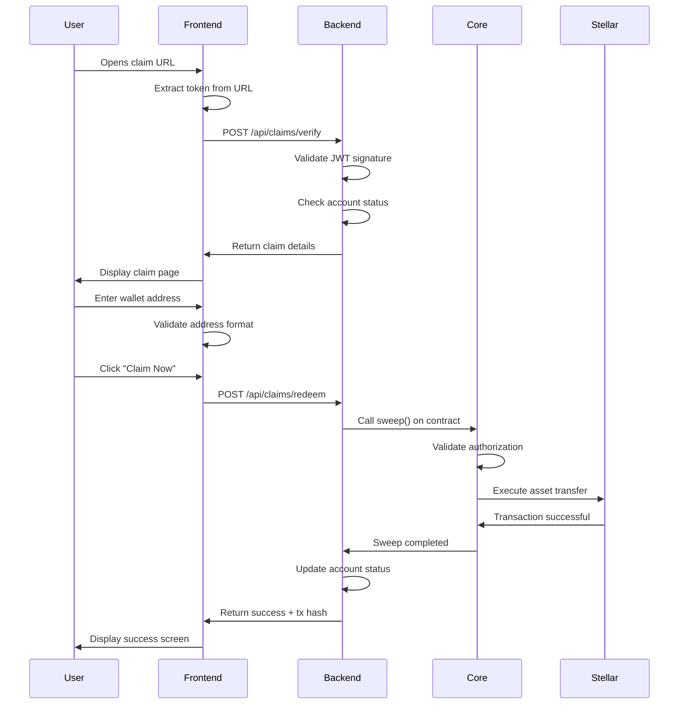
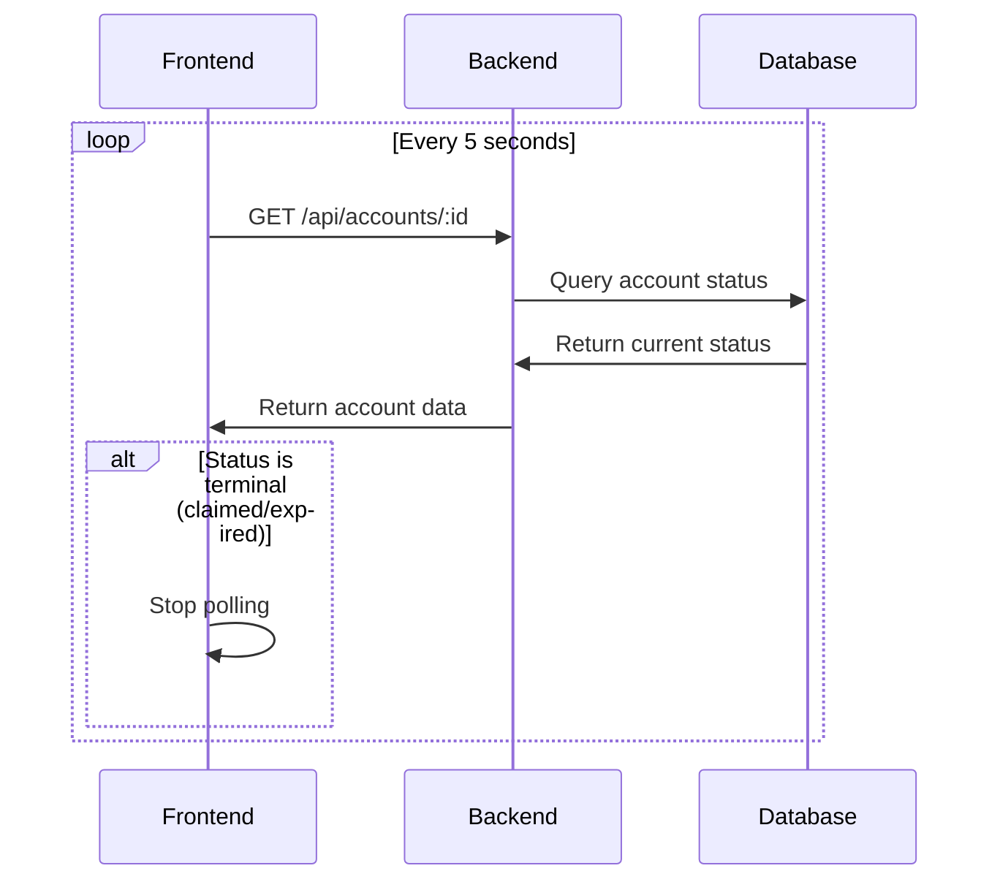
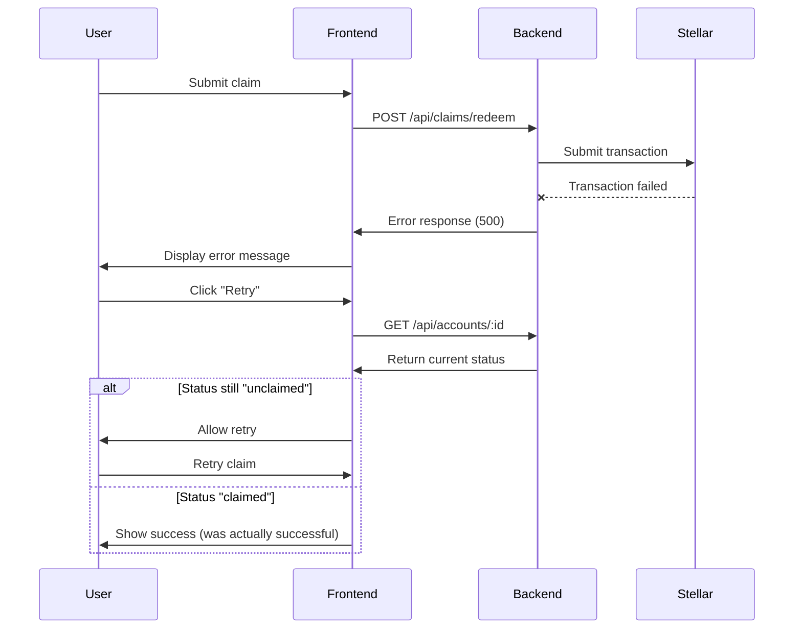

# Technical Specification Addendum for Frontend Development

**Version:** 1.0  
**Last Updated:** March, 2025  
**Status:** Draft for Review

---

## Table of Contents

1. [Backend API Integration](#1-backend-api-integration)
2. [Authentication & Session Management](#2-authentication--session-management)
3. [Wallet Integration Strategy](#3-wallet-integration-strategy)
4. [Real-Time Data Updates](#4-real-time-data-updates)
5. [Claim Token Handling](#5-claim-token-handling)
6. [Asset Management](#6-asset-management)
7. [Data Flow Diagrams](#7-data-flow-diagrams)
8. [Error Handling Catalog](#8-error-handling-catalog)
9. [State Management](#9-state-management)
10. [Environment Configuration](#10-environment-configuration)
11. [Security Considerations](#11-security-considerations)
12. [Testing Requirements](#12-testing-requirements)

---

## 1. Backend API Integration

### Base Configuration

```typescript
// API Base URLs
const API_CONFIG = {
  development: 'http://localhost:3000',
  testnet: 'https://testnet-api.bridgelet.io',
  production: 'https://api.bridgelet.io'
};

// Stellar Network Configuration
const STELLAR_CONFIG = {
  testnet: {
    horizonUrl: 'https://horizon-testnet.stellar.org',
    sorobanRpcUrl: 'https://soroban-testnet.stellar.org',
    networkPassphrase: 'Test SDF Network ; September 2015'
  },
  mainnet: {
    horizonUrl: 'https://horizon.stellar.org',
    sorobanRpcUrl: 'https://soroban-mainnet.stellar.org',
    networkPassphrase: 'Public Global Stellar Network ; September 2015'
  }
};
```

### API Endpoints Reference

#### Account Management

##### Create Ephemeral Account

```http
POST /api/accounts
```

**Headers:**
```
Content-Type: application/json
Authorization: Bearer {wallet_signature_token}
```

**Request Body:**
```json
{
  "amount": "100",
  "asset": "USDC:GBBD47IF6LWK7P7MDEVSCWR7DPUWV3NY3DTQEVFL4NAT4AQH3ZLLFLA5",
  "expiresIn": 2592000,
  "metadata": {
    "recipientName": "Bob",
    "message": "Happy Birthday!",
    "senderNote": "Q1 Payroll"
  }
}
```

**Response (201 Created):**
```json
{
  "accountId": "550e8400-e29b-41d4-a716-446655440000",
  "publicKey": "GEPHEMERAL7XXYYZZ...",
  "claimUrl": "https://claim.bridgelet.io/c/eyJhbGc...",
  "claimToken": "eyJhbGc...",
  "txHash": "a1b2c3d4e5f6...",
  "amount": "100",
  "asset": "USDC",
  "status": "pending_payment",
  "expiresAt": "2025-03-15T12:00:00Z",
  "createdAt": "2025-02-12T12:00:00Z"
}
```

**Error Responses:**
- `400` — Invalid request body
- `401` — Unauthorized (invalid/missing token)
- `402` — Insufficient balance in funding account
- `429` — Rate limit exceeded
- `500` — Server error

---

##### Get Account Details

```http
GET /api/accounts/:accountId
```

**Headers:**
```
Authorization: Bearer {wallet_signature_token}
```

**Response (200 OK):**
```json
{
  "accountId": "550e8400-e29b-41d4-a716-446655440000",
  "publicKey": "GEPHEMERAL7XXYYZZ...",
  "creator": "GCREATOR...",
  "amount": "100",
  "asset": "USDC",
  "status": "unclaimed",
  "claimUrl": "https://claim.bridgelet.io/c/eyJhbGc...",
  "expiresAt": "2025-03-15T12:00:00Z",
  "createdAt": "2025-02-12T12:00:00Z",
  "claimedAt": null,
  "claimedBy": null,
  "metadata": {
    "recipientName": "Bob",
    "message": "Happy Birthday!"
  }
}
```

**Error Responses:**
- `401` — Unauthorized
- `404` — Account not found

---

##### List Sender's Accounts

```http
GET /api/sender/accounts
```

**Headers:**
```
Authorization: Bearer {wallet_signature_token}
```

**Query Parameters:**

| Parameter | Values | Default |
|-----------|--------|---------|
| `status` | `unclaimed`, `claimed`, `expired` | *(optional)* |
| `limit` | 1–100 | `20` |
| `offset` | integer | `0` |
| `sortBy` | field name | `createdAt` |
| `sortOrder` | `asc`, `desc` | `desc` |

**Response (200 OK):**
```json
{
  "accounts": [
    {
      "accountId": "550e8400-e29b-41d4-a716-446655440000",
      "amount": "100",
      "asset": "USDC",
      "status": "unclaimed",
      "recipientName": "Bob",
      "expiresAt": "2025-03-15T12:00:00Z",
      "createdAt": "2025-02-12T12:00:00Z"
    }
  ],
  "pagination": {
    "total": 45,
    "limit": 20,
    "offset": 0,
    "hasMore": true
  }
}
```

---

#### Claim Management

##### Verify Claim Token

```http
POST /api/claims/verify
```

**Headers:**
```
Content-Type: application/json
```

**Request Body:**
```json
{
  "claimToken": "eyJhbGciOiJIUzI1NiIsInR5cCI6IkpXVCJ9..."
}
```

**Response (200 OK):**
```json
{
  "valid": true,
  "accountId": "550e8400-e29b-41d4-a716-446655440000",
  "amount": "100",
  "asset": "USDC",
  "assetCode": "USDC",
  "assetIssuer": "GBBD47IF6LWK7P7MDEVSCWR7DPUWV3NY3DTQEVFL4NAT4AQH3ZLLFLA5",
  "expiresAt": "2025-03-15T12:00:00Z",
  "status": "unclaimed",
  "metadata": {
    "senderName": "Alice",
    "message": "Happy Birthday!"
  }
}
```

**Error Responses:**
- `400` — Invalid token format
- `401` — Token expired or invalid signature
- `404` — Account not found
- `409` — Already claimed

---

##### Redeem Claim

```http
POST /api/claims/redeem
```

**Headers:**
```
Content-Type: application/json
```

**Request Body:**
```json
{
  "claimToken": "eyJhbGciOiJIUzI1NiIsInR5cCI6IkpXVCJ9...",
  "destinationAddress": "GDESTINATION..."
}
```

**Response (200 OK):**
```json
{
  "success": true,
  "txHash": "f1e2d3c4b5a6...",
  "amountSwept": "100",
  "asset": "USDC",
  "destination": "GDESTINATION...",
  "sweptAt": "2025-02-12T12:05:00Z"
}
```

**Error Responses:**
- `400` — Invalid destination address
- `401` — Invalid or expired claim token
- `409` — Already claimed
- `410` — Account expired
- `500` — Sweep execution failed

---

#### Asset Information

##### Get Supported Assets

```http
GET /api/assets
```

**Response (200 OK):**
```json
{
  "assets": [
    {
      "code": "XLM",
      "issuer": "native",
      "name": "Stellar Lumens",
      "icon": "https://cdn.bridgelet.io/assets/xlm.svg"
    },
    {
      "code": "USDC",
      "issuer": "GBBD47IF6LWK7P7MDEVSCWR7DPUWV3NY3DTQEVFL4NAT4AQH3ZLLFLA5",
      "name": "USD Coin",
      "icon": "https://cdn.bridgelet.io/assets/usdc.svg"
    }
  ]
}
```

---

### Request/Response Format Standards

All API requests must include:
- `Content-Type: application/json` header
- Valid authentication token (for protected endpoints)
- Request ID for tracing (optional but recommended)

All API responses follow this structure:

```typescript
// Success Response
{
  data: { /* response data */ },
  meta?: { /* pagination, timestamps, etc */ }
}

// Error Response
{
  error: {
    code: "ERROR_CODE",
    message: "Human-readable error message",
    details?: { /* additional context */ },
    timestamp: "2025-02-12T12:00:00Z",
    requestId: "req_abc123"
  }
}
```

### HTTP Status Codes

| Code | Meaning | Usage |
|------|---------|-------|
| 200 | OK | Successful GET, PUT, PATCH requests |
| 201 | Created | Successful POST creating a resource |
| 204 | No Content | Successful DELETE |
| 400 | Bad Request | Invalid request body/parameters |
| 401 | Unauthorized | Missing or invalid authentication |
| 403 | Forbidden | Valid auth but insufficient permissions |
| 404 | Not Found | Resource doesn't exist |
| 409 | Conflict | Resource state conflict (e.g., already claimed) |
| 410 | Gone | Resource expired/permanently unavailable |
| 429 | Too Many Requests | Rate limit exceeded |
| 500 | Internal Server Error | Server-side error |
| 503 | Service Unavailable | Temporary service disruption |

### Rate Limiting

**Headers returned with every response:**
```
X-RateLimit-Limit: 100
X-RateLimit-Remaining: 95
X-RateLimit-Reset: 1709308800
```

**Rate Limits:**
- Account creation: 100 per hour per authenticated user
- Claim verification: 1000 per hour per IP
- Claim redemption: 10 per hour per claim token
- General API calls: 1000 per hour per authenticated user

**When rate limited (429):**
```json
{
  "error": {
    "code": "RATE_LIMIT_EXCEEDED",
    "message": "Rate limit exceeded. Please try again in 15 minutes.",
    "retryAfter": 900,
    "timestamp": "2025-02-12T12:00:00Z"
  }
}
```

---

## 2. Authentication & Session Management

### Overview

Bridgelet uses wallet-based authentication for senders. Recipients do not need authentication (stateless claim process).

### Sender Authentication Flow



### Implementation Details

#### Step 1: Request Authentication Challenge

```http
POST /api/auth/challenge
```

**Request:**
```json
{
  "publicKey": "GSENDER..."
}
```

**Response:**
```json
{
  "challenge": "bridgelet-auth-1709308800-abc123",
  "expiresAt": "2025-02-12T12:05:00Z"
}
```

#### Step 2: Sign Challenge with Wallet

```typescript
// Frontend signs challenge
import { Keypair } from '@stellar/stellar-sdk';

const signature = await walletProvider.signMessage(challenge);

// Or if using Freighter
const signature = await window.freighter.signAuthEntry(
  challenge,
  { networkPassphrase: NETWORK_PASSPHRASE }
);
```

#### Step 3: Submit Signature for Token

```http
POST /api/auth/verify
```

**Request:**
```json
{
  "publicKey": "GSENDER...",
  "challenge": "bridgelet-auth-1709308800-abc123",
  "signature": "base64_signature..."
}
```

**Response:**
```json
{
  "token": "eyJhbGciOiJFUzI1NiIsInR5cCI6IkpXVCJ9...",
  "expiresAt": "2025-02-12T18:00:00Z",
  "walletAddress": "GSENDER..."
}
```

### JWT Token Structure

**Token Payload:**
```json
{
  "sub": "GSENDER...",
  "iat": 1709308800,
  "exp": 1709330400,
  "type": "wallet_auth"
}
```

**Token Expiration:**
- Default: 6 hours
- Maximum: 24 hours
- Refresh: Not implemented in MVP (user re-authenticates)

### Using the Authentication Token

Include in all authenticated requests:

```typescript
fetch('/api/accounts', {
  method: 'POST',
  headers: {
    'Content-Type': 'application/json',
    'Authorization': `Bearer ${token}`
  },
  body: JSON.stringify(accountData)
});
```

### Session Management

**Client-side session storage:**

```typescript
interface Session {
  token: string;
  walletAddress: string;
  expiresAt: string;
  connectedAt: string;
}

// Store in sessionStorage (cleared on tab close)
sessionStorage.setItem('bridgelet_session', JSON.stringify(session));

// Or localStorage (persists across tabs/sessions)
localStorage.setItem('bridgelet_session', JSON.stringify(session));
```

**Session validation:**

```typescript
function isSessionValid(session: Session): boolean {
  const now = Date.now();
  const expiresAt = new Date(session.expiresAt).getTime();

  // Check if token expired
  if (now >= expiresAt) {
    return false;
  }

  // Check if token expires in next 5 minutes (proactive refresh)
  if (expiresAt - now < 5 * 60 * 1000) {
    // Trigger re-authentication
    return false;
  }

  return true;
}
```

### Logout

```http
POST /api/auth/logout
```

**Headers:**
```
Authorization: Bearer {token}
```

**Response:** `204 No Content`

```typescript
function logout() {
  // Clear token
  sessionStorage.removeItem('bridgelet_session');

  // Optionally disconnect wallet
  await walletProvider.disconnect();

  // Redirect to homepage
  window.location.href = '/';
}
```

### Security Best Practices

1. **Never store private keys** — Only store public keys and signatures
2. **Use sessionStorage by default** — More secure than localStorage
3. **Validate token expiration client-side** — Prevent unnecessary API calls
4. **Handle 401 responses** — Auto-logout and redirect to login
5. **Use HTTPS only** — Tokens must never be sent over HTTP

---

## 3. Wallet Integration Strategy

### Supported Wallets (MVP)

| Wallet | Platform | Priority | Integration Method |
|--------|----------|----------|--------------------|
| Freighter | Desktop (Chrome/Firefox) | High | Browser extension API |
| LOBSTR | Mobile (iOS/Android) | High | WalletConnect v2 |
| Albedo | Desktop (all browsers) | Medium | Albedo SDK |

### Freighter Integration (Desktop)

**Installation Check:**

```typescript
function isFreighterInstalled(): boolean {
  return typeof window.freighter !== 'undefined';
}

function promptFreighterInstall() {
  window.open('https://freighter.app/', '_blank');
}
```

**Connect Wallet:**

```typescript
async function connectFreighter(): Promise<string> {
  if (!isFreighterInstalled()) {
    throw new Error('FREIGHTER_NOT_INSTALLED');
  }

  try {
    const publicKey = await window.freighter.getPublicKey();
    return publicKey;
  } catch (error) {
    if (error.code === 1) {
      throw new Error('USER_REJECTED');
    }
    throw error;
  }
}
```

**Sign Transaction:**

```typescript
async function signTransaction(xdr: string): Promise<string> {
  const { signedTxXdr } = await window.freighter.signTransaction(xdr, {
    networkPassphrase: NETWORK_PASSPHRASE
  });

  return signedTxXdr;
}
```

### LOBSTR Integration (Mobile via WalletConnect)

**Setup WalletConnect:**

```typescript
import { WalletConnectClient } from '@walletconnect/client';
import { StellarWallet } from '@stellar/walletconnect';

const walletConnect = new StellarWallet({
  projectId: 'YOUR_WALLETCONNECT_PROJECT_ID',
  metadata: {
    name: 'Bridgelet',
    description: 'Crypto payments for everyone',
    url: 'https://bridgelet.io',
    icons: ['https://bridgelet.io/icon.png']
  }
});
```

**Connect:**

```typescript
async function connectWalletConnect(): Promise<string> {
  try {
    await walletConnect.connect();
    const accounts = walletConnect.getAccounts();
    return accounts[0]; // Returns Stellar public key
  } catch (error) {
    throw new Error('WALLETCONNECT_FAILED');
  }
}
```

**Sign Transaction:**

```typescript
async function signWithWalletConnect(xdr: string): Promise<string> {
  const signedXdr = await walletConnect.signTransaction(xdr);
  return signedXdr;
}
```

### Wallet Detection & Selection

```typescript
interface WalletProvider {
  id: 'freighter' | 'walletconnect' | 'albedo';
  name: string;
  icon: string;
  available: boolean;
  connect: () => Promise<string>;
  disconnect: () => Promise<void>;
  signTransaction: (xdr: string) => Promise<string>;
}

function detectAvailableWallets(): WalletProvider[] {
  const wallets: WalletProvider[] = [];

  // Check Freighter
  if (typeof window.freighter !== 'undefined') {
    wallets.push({
      id: 'freighter',
      name: 'Freighter',
      icon: '/wallets/freighter.svg',
      available: true,
      connect: connectFreighter,
      disconnect: disconnectFreighter,
      signTransaction: signWithFreighter
    });
  }

  // WalletConnect always available (shows QR code)
  wallets.push({
    id: 'walletconnect',
    name: 'Mobile Wallet',
    icon: '/wallets/walletconnect.svg',
    available: true,
    connect: connectWalletConnect,
    disconnect: disconnectWalletConnect,
    signTransaction: signWithWalletConnect
  });

  return wallets;
}
```

### Wallet Connection UI Flow

**Sender Flow (Payment Creation):**
```
1. User clicks "Send Funds"
2. If not connected: Show wallet selection modal
3. User selects wallet
4. Wallet connection initiated
5. User approves in wallet
6. Connection success → Continue to form
```

**Transaction Signing:**
```
1. User fills form and clicks "Confirm & Pay"
2. Backend returns transaction XDR
3. Frontend requests signature from wallet
4. Wallet shows transaction details
5. User approves
6. Signed transaction sent to backend
7. Backend submits to Stellar network
```

### Recipient Flow (No Wallet Connection Required)

Recipients only provide an address string:

```typescript
// Recipient input — NO wallet connection needed
interface ClaimFormData {
  destinationAddress: string; // Just a string input
}

// Validation only
function validateStellarAddress(address: string): boolean {
  if (!address.startsWith('G')) return false;
  if (address.length !== 56) return false;

  // Use Stellar SDK for checksum validation
  try {
    StrKey.decodeEd25519PublicKey(address);
    return true;
  } catch {
    return false;
  }
}
```

**"Don't have a wallet?" Helper:**

```typescript
const WALLET_CREATION_LINKS = {
  mobile: 'https://lobstr.co/',
  desktop: 'https://freighter.app/'
};

function redirectToWalletCreation() {
  const isMobile = /iPhone|iPad|Android/i.test(navigator.userAgent);
  const url = isMobile ? WALLET_CREATION_LINKS.mobile : WALLET_CREATION_LINKS.desktop;
  window.open(url, '_blank');
}
```

### Error Handling

```typescript
enum WalletError {
  NOT_INSTALLED = 'WALLET_NOT_INSTALLED',
  USER_REJECTED = 'USER_REJECTED_CONNECTION',
  NETWORK_MISMATCH = 'NETWORK_MISMATCH',
  TRANSACTION_REJECTED = 'TRANSACTION_REJECTED',
  TIMEOUT = 'CONNECTION_TIMEOUT'
}

function handleWalletError(error: WalletError): string {
  const messages = {
    [WalletError.NOT_INSTALLED]: 'Wallet not installed. Please install Freighter or use a mobile wallet.',
    [WalletError.USER_REJECTED]: 'Connection cancelled. Please try again.',
    [WalletError.NETWORK_MISMATCH]: 'Wallet is on wrong network. Please switch to Testnet.',
    [WalletError.TRANSACTION_REJECTED]: 'Transaction declined in wallet.',
    [WalletError.TIMEOUT]: 'Connection timed out. Please try again.'
  };

  return messages[error] || 'Wallet connection failed. Please try again.';
}
```

### Mobile Considerations

**Deep Linking for Mobile Wallets:**

```typescript
function openMobileWallet(txXdr: string) {
  // LOBSTR deep link
  const lobstrUrl = `lobstr://sign?xdr=${encodeURIComponent(txXdr)}`;

  // Attempt to open
  window.location.href = lobstrUrl;

  // Fallback after 2 seconds
  setTimeout(() => {
    if (document.hasFocus()) {
      // App didn't open, redirect to store
      window.open('https://lobstr.co/download', '_blank');
    }
  }, 2000);
}
```

---

## 4. Real-Time Data Updates

### Strategy: Polling (MVP)

For MVP, use polling for simplicity. WebSockets can be added in Phase 2.

### Polling Configuration

```typescript
const POLLING_CONFIG = {
  intervals: {
    accountStatus: 5000,      // 5 seconds
    dashboardList: 10000,     // 10 seconds
    transactionStatus: 2000   // 2 seconds (during active operations)
  },
  stopConditions: {
    maxAttempts: 60,          // Stop after 60 attempts (5 minutes at 5s interval)
    terminalStates: ['claimed', 'expired', 'failed']
  }
};
```

### Implementation Examples

**Poll Account Status:**

```typescript
interface PollOptions {
  accountId: string;
  interval: number;
  maxAttempts: number;
  onUpdate: (status: AccountStatus) => void;
  onError: (error: Error) => void;
}

function pollAccountStatus(options: PollOptions): () => void {
  let attempts = 0;
  let intervalId: NodeJS.Timeout;

  const poll = async () => {
    attempts++;

    try {
      const response = await fetch(`/api/accounts/${options.accountId}`);
      const account = await response.json();

      options.onUpdate(account.status);

      // Stop polling on terminal state
      if (POLLING_CONFIG.stopConditions.terminalStates.includes(account.status)) {
        clearInterval(intervalId);
      }

      // Stop polling on max attempts
      if (attempts >= options.maxAttempts) {
        clearInterval(intervalId);
        options.onError(new Error('POLLING_TIMEOUT'));
      }
    } catch (error) {
      options.onError(error);
    }
  };

  // Start polling
  intervalId = setInterval(poll, options.interval);
  poll(); // Call immediately

  // Return cleanup function
  return () => clearInterval(intervalId);
}

// Usage
const stopPolling = pollAccountStatus({
  accountId: '550e8400-e29b-41d4-a716-446655440000',
  interval: POLLING_CONFIG.intervals.accountStatus,
  maxAttempts: POLLING_CONFIG.stopConditions.maxAttempts,
  onUpdate: (status) => {
    console.log('Status updated:', status);
    updateUI(status);
  },
  onError: (error) => {
    console.error('Polling error:', error);
    showError(error);
  }
});

// Cleanup when component unmounts
useEffect(() => {
  return () => stopPolling();
}, []);
```

**Dashboard List Polling:**

```typescript
function useDashboardPolling(walletAddress: string) {
  const [accounts, setAccounts] = useState([]);
  const [loading, setLoading] = useState(true);

  useEffect(() => {
    let intervalId: NodeJS.Timeout;

    const fetchAccounts = async () => {
      try {
        const response = await fetch('/api/sender/accounts', {
          headers: {
            'Authorization': `Bearer ${token}`
          }
        });
        const data = await response.json();
        setAccounts(data.accounts);
        setLoading(false);
      } catch (error) {
        console.error('Failed to fetch accounts:', error);
      }
    };

    // Initial fetch
    fetchAccounts();

    // Poll every 10 seconds
    intervalId = setInterval(fetchAccounts, POLLING_CONFIG.intervals.dashboardList);

    return () => clearInterval(intervalId);
  }, [walletAddress]);

  return { accounts, loading };
}
```

### Optimistic UI Updates

Update UI immediately, then confirm with server:

```typescript
async function claimFunds(claimToken: string, destinationAddress: string) {
  // 1. Optimistically update UI
  setStatus('claiming');
  setProgress(0);

  try {
    const response = await fetch('/api/claims/redeem', {
      method: 'POST',
      headers: { 'Content-Type': 'application/json' },
      body: JSON.stringify({ claimToken, destinationAddress })
    });

    // 2. Poll for transaction confirmation
    const { txHash } = await response.json();

    const confirmTransaction = async () => {
      const horizonServer = new Horizon.Server(HORIZON_URL);

      try {
        const tx = await horizonServer.transactions().transaction(txHash).call();

        if (tx.successful) {
          setStatus('success');
          setProgress(100);
        } else {
          setStatus('failed');
        }
      } catch (error) {
        // Transaction not yet confirmed, retry
        setTimeout(confirmTransaction, 2000);
      }
    };

    confirmTransaction();
  } catch (error) {
    // 3. Revert optimistic update on error
    setStatus('error');
    setProgress(0);
  }
}
```

### Phase 2: WebSocket Upgrade Plan

```typescript
// WebSocket connection (Phase 2)
const ws = new WebSocket('wss://api.bridgelet.io/ws');

ws.onopen = () => {
  ws.send(JSON.stringify({
    type: 'subscribe',
    accountId: '550e8400-e29b-41d4-a716-446655440000'
  }));
};

ws.onmessage = (event) => {
  const update = JSON.parse(event.data);

  if (update.type === 'account_update') {
    updateUI(update.data);
  }
};
```

---

## 5. Claim Token Handling

### Token Structure

Claim tokens are **JWT (JSON Web Tokens)** signed by the backend.

**Token Anatomy:**
```
eyJhbGciOiJIUzI1NiIsInR5cCI6IkpXVCJ9
  .eyJhY2NvdW50SWQiOiI1NTBlODQwMC1lMjliLTQxZDQtYTcxNi00NDY2NTU0NDAwMDAi...
  .signature

│ Header │ Payload │ Signature │
```

**Decoded Payload:**
```json
{
  "accountId": "550e8400-e29b-41d4-a716-446655440000",
  "amount": "100",
  "asset": "USDC:GBBD47IF6LWK7P7MDEVSCWR7DPUWV3NY3DTQEVFL4NAT4AQH3ZLLFLA5",
  "expiresAt": "2025-03-15T12:00:00Z",
  "iat": 1709308800,
  "exp": 1709913600
}
```

### Frontend Token Handling

**Extract Token from URL:**

```typescript
// URL: https://claim.bridgelet.io/c/eyJhbGciOiJIUzI1NiIsInR5cCI6IkpXVCJ9...

function extractClaimToken(): string | null {
  const path = window.location.pathname;
  const match = path.match(/\/c\/(.+)/);
  return match ? match[1] : null;
}
```

**Decode Token (Client-Side — for display only):**

```typescript
import jwt_decode from 'jwt-decode';

interface ClaimTokenPayload {
  accountId: string;
  amount: string;
  asset: string;
  expiresAt: string;
  iat: number;
  exp: number;
}

function decodeClaimToken(token: string): ClaimTokenPayload {
  try {
    return jwt_decode<ClaimTokenPayload>(token);
  } catch (error) {
    throw new Error('INVALID_TOKEN_FORMAT');
  }
}

// Usage
const token = extractClaimToken();
const payload = decodeClaimToken(token);
console.log('Amount:', payload.amount);
console.log('Expires:', payload.expiresAt);
```

> ⚠️ **Important:** Client-side decoding is only for display. Always verify token with the backend before allowing claims.

### Token Verification Flow

```typescript
async function verifyClaimToken(token: string): Promise<ClaimDetails> {
  try {
    const response = await fetch('/api/claims/verify', {
      method: 'POST',
      headers: { 'Content-Type': 'application/json' },
      body: JSON.stringify({ claimToken: token })
    });

    if (!response.ok) {
      const error = await response.json();
      throw new Error(error.error.code);
    }

    const claimDetails = await response.json();
    return claimDetails;
  } catch (error) {
    if (error.message === 'TOKEN_EXPIRED') {
      throw new Error('This claim link has expired');
    }
    if (error.message === 'ALREADY_CLAIMED') {
      throw new Error('This payment has already been claimed');
    }
    throw new Error('Invalid claim link');
  }
}
```

### Token Expiration Checking

**Client-side pre-check (before API call):**

```typescript
function isTokenExpired(token: string): boolean {
  try {
    const payload = decodeClaimToken(token);
    const now = Math.floor(Date.now() / 1000);
    return now >= payload.exp;
  } catch {
    return true; // Treat invalid tokens as expired
  }
}

// Usage
const token = extractClaimToken();

if (!token) {
  showError('Invalid claim link');
  return;
}

if (isTokenExpired(token)) {
  showError('This claim link has expired');
  return;
}

// Token looks valid, verify with backend
const claimDetails = await verifyClaimToken(token);
```

### Token Security

**What Frontend Should Do:**
- ✅ Extract token from URL
- ✅ Decode for display purposes only
- ✅ Check expiration client-side (UX optimization)
- ✅ Always verify with backend before allowing claim
- ✅ Clear token from URL after extraction (optional, for privacy)

**What Frontend Should NOT Do:**
- ❌ Trust decoded token contents without backend verification
- ❌ Validate token signature client-side (impossible without secret key)
- ❌ Modify or regenerate tokens
- ❌ Store tokens long-term (single-use)

### Error Scenarios

```typescript
enum TokenError {
  INVALID_FORMAT = 'INVALID_TOKEN_FORMAT',
  EXPIRED = 'TOKEN_EXPIRED',
  ALREADY_USED = 'ALREADY_CLAIMED',
  ACCOUNT_NOT_FOUND = 'ACCOUNT_NOT_FOUND',
  NETWORK_ERROR = 'NETWORK_ERROR'
}

function getTokenErrorMessage(error: TokenError): string {
  const messages = {
    [TokenError.INVALID_FORMAT]: 'Invalid claim link format. Please check the link and try again.',
    [TokenError.EXPIRED]: 'This claim link has expired. Please contact the sender for a new link.',
    [TokenError.ALREADY_USED]: 'This payment has already been claimed.',
    [TokenError.ACCOUNT_NOT_FOUND]: 'Claim not found. The link may be invalid or the account may have been deleted.',
    [TokenError.NETWORK_ERROR]: 'Network error. Please check your connection and try again.'
  };

  return messages[error] || 'An error occurred. Please try again.';
}
```

---

## 6. Asset Management

### Asset Format

Assets use Stellar's standard format:

```
{CODE}:{ISSUER}

Examples:
- XLM:native
- USDC:GBBD47IF6LWK7P7MDEVSCWR7DPUWV3NY3DTQEVFL4NAT4AQH3ZLLFLA5
- EURC:GDHU6WRG4IEQXM5NZ4BMPKOXHW76MZM4Y2IEMFDVXBSDP6SJY4ITNPP2
```

### Supported Assets (MVP)

```typescript
interface Asset {
  code: string;       // Asset code (e.g., "USDC")
  issuer: string;     // Issuer address or "native"
  name: string;       // Display name
  icon: string;       // Icon URL
  decimals: number;   // Decimal places (usually 7 for Stellar)
}

const SUPPORTED_ASSETS: Asset[] = [
  {
    code: 'XLM',
    issuer: 'native',
    name: 'Stellar Lumens',
    icon: '/assets/xlm.svg',
    decimals: 7
  },
  {
    code: 'USDC',
    issuer: 'GBBD47IF6LWK7P7MDEVSCWR7DPUWV3NY3DTQEVFL4NAT4AQH3ZLLFLA5',
    name: 'USD Coin',
    icon: '/assets/usdc.svg',
    decimals: 7
  }
];
```

### Asset Selection Component

```typescript
interface AssetSelectorProps {
  selectedAsset: string;  // Format: "CODE:ISSUER"
  onChange: (asset: string) => void;
}

function AssetSelector({ selectedAsset, onChange }: AssetSelectorProps) {
  return (
    <select
      value={selectedAsset}
      onChange={(e) => onChange(e.target.value)}
    >
      {SUPPORTED_ASSETS.map((asset) => (
        <option
          key={`${asset.code}:${asset.issuer}`}
          value={`${asset.code}:${asset.issuer}`}
        >
          {asset.name} ({asset.code})
        </option>
      ))}
    </select>
  );
}
```

### Asset Display

**Display asset with icon:**

```typescript
function AssetDisplay({ asset }: { asset: string }) {
  const [code, issuer] = asset.split(':');
  const assetData = SUPPORTED_ASSETS.find(
    a => a.code === code && a.issuer === issuer
  );

  return (
    <div className="asset-display">
      
      <span>{code}</span>
    </div>
  );
}
```

**Format amount with asset:**

```typescript
function formatAmount(amount: string, asset: string): string {
  const [code] = asset.split(':');
  const assetData = SUPPORTED_ASSETS.find(a => a.code === code);

  const numAmount = parseFloat(amount);
  const formatted = numAmount.toFixed(assetData?.decimals || 7);

  // Remove trailing zeros
  const trimmed = formatted.replace(/\.?0+$/, '');

  return `${trimmed} ${code}`;
}

// Usage
formatAmount('100.0000000', 'USDC:GBBD...'); // "100 USDC"
formatAmount('0.5000000', 'XLM:native');     // "0.5 XLM"
```

### Asset Validation

```typescript
function validateAsset(asset: string): boolean {
  const [code, issuer] = asset.split(':');

  if (!code || !issuer) return false;

  const isSupported = SUPPORTED_ASSETS.some(
    a => a.code === code && a.issuer === issuer
  );

  if (!isSupported) {
    console.warn(`Asset ${code}:${issuer} not supported`);
    return false;
  }

  if (issuer !== 'native') {
    if (!issuer.startsWith('G') || issuer.length !== 56) {
      return false;
    }
  }

  return true;
}
```

### Phase 2: Dynamic Asset List

```typescript
async function fetchSupportedAssets(): Promise<Asset[]> {
  const response = await fetch('/api/assets');
  const data = await response.json();
  return data.assets;
}

// Cache assets in context/state
const [supportedAssets, setSupportedAssets] = useState<Asset[]>([]);

useEffect(() => {
  fetchSupportedAssets().then(setSupportedAssets);
}, []);
```

---

## 7. Data Flow Diagrams

### Account Creation Flow



### Claim Redemption Flow



### Status Polling Flow



### Error Recovery Flow



---

## 8. Error Handling Catalog

### Complete Error Reference

| Error Code | HTTP Status | Cause | User Message | Action |
|------------|-------------|-------|--------------|--------|
| `INVALID_REQUEST` | 400 | Malformed request body | Invalid request. Please check your input. | Show form validation |
| `INSUFFICIENT_BALANCE` | 402 | Funding account lacks funds | Insufficient balance to create payment. | Check wallet balance |
| `INVALID_ASSET` | 400 | Asset format incorrect | Selected asset is invalid. | Re-select asset |
| `INVALID_AMOUNT` | 400 | Amount ≤ 0 or too large | Please enter a valid amount. | Fix amount input |
| `INVALID_EXPIRY` | 400 | Expiry outside allowed range | Expiry must be between 1 hour and 90 days. | Adjust expiry |
| `UNAUTHORIZED` | 401 | Missing/invalid auth token | Please connect your wallet. | Redirect to login |
| `CLAIM_TOKEN_INVALID` | 401 | Token signature invalid | Invalid claim link. | Show error page |
| `CLAIM_TOKEN_EXPIRED` | 401 | Token past expiration | This claim link has expired. | Contact sender |
| `ACCOUNT_NOT_FOUND` | 404 | Account doesn't exist | Claim not found. | Show error page |
| `ALREADY_CLAIMED` | 409 | Double claim attempt | This payment has already been claimed. | Show claimed page |
| `ACCOUNT_EXPIRED` | 410 | Account past expiry | This claim has expired. | Show expired page |
| `INVALID_DESTINATION` | 400 | Stellar address format wrong | Please enter a valid Stellar address. | Fix address input |
| `SWEEP_FAILED` | 500 | On-chain transaction failed | Claim failed. Please try again. | Retry button |
| `NETWORK_ERROR` | 503 | Stellar network unavailable | Network temporarily unavailable. | Retry with backoff |
| `RATE_LIMIT_EXCEEDED` | 429 | Too many requests | Too many attempts. Please wait. | Show countdown |
| `WALLET_NOT_CONNECTED` | 401 | Wallet connection required | Please connect your wallet. | Show wallet modal |

### Error Response Handler

```typescript
interface ErrorResponse {
  error: {
    code: string;
    message: string;
    details?: any;
    timestamp: string;
    requestId?: string;
  };
}

class APIError extends Error {
  code: string;
  statusCode: number;
  details?: any;
  requestId?: string;

  constructor(response: ErrorResponse, statusCode: number) {
    super(response.error.message);
    this.code = response.error.code;
    this.statusCode = statusCode;
    this.details = response.error.details;
    this.requestId = response.error.requestId;
  }
}

async function handleAPIResponse<T>(response: Response): Promise<T> {
  if (!response.ok) {
    const errorData: ErrorResponse = await response.json();
    throw new APIError(errorData, response.status);
  }

  return response.json();
}
```

### Error Display Component

```typescript
interface ErrorDisplayProps {
  error: APIError;
  onRetry?: () => void;
  onDismiss?: () => void;
}

function ErrorDisplay({ error, onRetry, onDismiss }: ErrorDisplayProps) {
  const userMessage = getUserFriendlyMessage(error.code);
  const canRetry = isRetryableError(error.code);

  return (
    <div className="error-container">
      <div className="error-icon">❌</div>
      <h2>{userMessage.title}</h2>
      <p>{userMessage.description}</p>

      {error.details && (
        <details>
          <summary>Technical Details</summary>
          <pre>{JSON.stringify(error.details, null, 2)}</pre>
        </details>
      )}

      <div className="error-actions">
        {canRetry && onRetry && (
          <button onClick={onRetry}>Try Again</button>
        )}
        {onDismiss && (
          <button onClick={onDismiss}>Dismiss</button>
        )}
        <a href="/support">Contact Support</a>
      </div>

      {error.requestId && (
        <p className="request-id">Request ID: {error.requestId}</p>
      )}
    </div>
  );
}
```

### Retry Logic

```typescript
interface RetryConfig {
  maxAttempts: number;
  baseDelay: number;
  maxDelay: number;
  backoffMultiplier: number;
}

async function fetchWithRetry<T>(
  fetchFn: () => Promise<T>,
  config: RetryConfig = {
    maxAttempts: 3,
    baseDelay: 1000,
    maxDelay: 10000,
    backoffMultiplier: 2
  }
): Promise<T> {
  let lastError: Error;

  for (let attempt = 0; attempt < config.maxAttempts; attempt++) {
    try {
      return await fetchFn();
    } catch (error) {
      lastError = error as Error;

      // Don't retry on client errors (4xx)
      if (error instanceof APIError && error.statusCode < 500) {
        throw error;
      }

      const delay = Math.min(
        config.baseDelay * Math.pow(config.backoffMultiplier, attempt),
        config.maxDelay
      );

      if (attempt < config.maxAttempts - 1) {
        await new Promise(resolve => setTimeout(resolve, delay));
      }
    }
  }

  throw lastError!;
}

// Usage
const claimDetails = await fetchWithRetry(() =>
  verifyClaimToken(token)
);
```

### Global Error Boundary

```typescript
import { Component, ReactNode } from 'react';

interface Props {
  children: ReactNode;
  fallback?: (error: Error) => ReactNode;
}

interface State {
  hasError: boolean;
  error: Error | null;
}

class ErrorBoundary extends Component<Props, State> {
  constructor(props: Props) {
    super(props);
    this.state = { hasError: false, error: null };
  }

  static getDerivedStateFromError(error: Error): State {
    return { hasError: true, error };
  }

  componentDidCatch(error: Error, errorInfo: any) {
    console.error('ErrorBoundary caught:', error, errorInfo);

    fetch('/api/errors/report', {
      method: 'POST',
      headers: { 'Content-Type': 'application/json' },
      body: JSON.stringify({
        error: error.message,
        stack: error.stack,
        componentStack: errorInfo.componentStack
      })
    });
  }

  render() {
    if (this.state.hasError) {
      if (this.props.fallback) {
        return this.props.fallback(this.state.error!);
      }

      return (
        <div className="error-page">
          <h1>Something went wrong</h1>
          <p>We're sorry, but something unexpected happened.</p>
          <button onClick={() => window.location.reload()}>
            Reload Page
          </button>
        </div>
      );
    }

    return this.props.children;
  }
}
```

---

## 9. State Management

### Recommended Approach: React Context + Hooks

For MVP, use React Context API. A state management library (Redux, Zustand) can be added later if needed.

### Context Structure

```typescript
// contexts/AppContext.tsx
interface AppState {
  wallet: {
    connected: boolean;
    address: string | null;
    provider: 'freighter' | 'walletconnect' | null;
  };
  auth: {
    token: string | null;
    expiresAt: string | null;
  };
  ui: {
    loading: boolean;
    error: string | null;
    modal: string | null;
  };
  sender: {
    accounts: Account[];
    loading: boolean;
  };
}

interface AppContextType {
  state: AppState;
  actions: {
    connectWallet: (provider: string) => Promise<void>;
    disconnectWallet: () => void;
    login: (walletAddress: string) => Promise<void>;
    logout: () => void;
    createAccount: (data: CreateAccountData) => Promise<Account>;
    fetchAccounts: () => Promise<void>;
    setLoading: (loading: boolean) => void;
    setError: (error: string | null) => void;
    openModal: (modal: string) => void;
    closeModal: () => void;
  };
}

const AppContext = createContext<AppContextType | undefined>(undefined);

export function AppProvider({ children }: { children: ReactNode }) {
  const [state, setState] = useState<AppState>({
    wallet: { connected: false, address: null, provider: null },
    auth: { token: null, expiresAt: null },
    ui: { loading: false, error: null, modal: null },
    sender: { accounts: [], loading: false }
  });

  const actions = {
    connectWallet: async (provider: string) => {
      // Implementation
    },
    // ... other actions
  };

  return (
    <AppContext.Provider value={{ state, actions }}>
      {children}
    </AppContext.Provider>
  );
}

export function useApp() {
  const context = useContext(AppContext);
  if (!context) {
    throw new Error('useApp must be used within AppProvider');
  }
  return context;
}
```

### Usage in Components

```typescript
function CreateClaimForm() {
  const { state, actions } = useApp();
  const [formData, setFormData] = useState({
    amount: '',
    asset: 'USDC:GBBD47...',
    expiresIn: 2592000
  });

  const handleSubmit = async (e: React.FormEvent) => {
    e.preventDefault();

    try {
      actions.setLoading(true);
      const account = await actions.createAccount(formData);
      navigate(`/success/${account.accountId}`);
    } catch (error) {
      actions.setError(error.message);
    } finally {
      actions.setLoading(false);
    }
  };

  return (
    <form onSubmit={handleSubmit}>
      {/* Form fields */}
      <button disabled={state.ui.loading || !state.wallet.connected}>
        {state.ui.loading ? 'Creating...' : 'Create Payment'}
      </button>
      {state.ui.error && <div className="error">{state.ui.error}</div>}
    </form>
  );
}
```

### Local Storage Persistence

```typescript
// hooks/usePersistentState.ts
function usePersistentState<T>(key: string, initialValue: T): [T, (value: T) => void] {
  const [state, setState] = useState<T>(() => {
    try {
      const item = window.sessionStorage.getItem(key);
      return item ? JSON.parse(item) : initialValue;
    } catch {
      return initialValue;
    }
  });

  const setValue = (value: T) => {
    try {
      setState(value);
      window.sessionStorage.setItem(key, JSON.stringify(value));
    } catch (error) {
      console.error(`Error saving to sessionStorage:`, error);
    }
  };

  return [state, setValue];
}

// Usage
const [session, setSession] = usePersistentState('bridgelet_session', null);
```

### Optimistic Updates Pattern

```typescript
function useOptimisticUpdate() {
  const { state, actions } = useApp();

  async function withOptimisticUpdate<T>(
    optimisticState: Partial<AppState>,
    asyncFn: () => Promise<T>
  ): Promise<T> {
    const previousState = { ...state };
    setState({ ...state, ...optimisticState });

    try {
      const result = await asyncFn();
      return result;
    } catch (error) {
      setState(previousState);
      throw error;
    }
  }

  return { withOptimisticUpdate };
}

// Usage
const { withOptimisticUpdate } = useOptimisticUpdate();

const handleClaim = async () => {
  await withOptimisticUpdate(
    { ui: { loading: true, error: null } },
    () => redeemClaim(token, address)
  );
};
```

---

## 10. Environment Configuration

### Environment Variables

```bash
# .env.development
REACT_APP_ENV=development
REACT_APP_API_URL=http://localhost:3000
REACT_APP_STELLAR_NETWORK=testnet
REACT_APP_HORIZON_URL=https://horizon-testnet.stellar.org
REACT_APP_SOROBAN_RPC_URL=https://soroban-testnet.stellar.org
REACT_APP_NETWORK_PASSPHRASE=Test SDF Network ; September 2015
REACT_APP_WALLETCONNECT_PROJECT_ID=your_project_id_here
REACT_APP_CLAIM_BASE_URL=http://localhost:3001

# .env.testnet
REACT_APP_ENV=testnet
REACT_APP_API_URL=https://testnet-api.bridgelet.io
REACT_APP_STELLAR_NETWORK=testnet
REACT_APP_HORIZON_URL=https://horizon-testnet.stellar.org
REACT_APP_SOROBAN_RPC_URL=https://soroban-testnet.stellar.org
REACT_APP_NETWORK_PASSPHRASE=Test SDF Network ; September 2015
REACT_APP_WALLETCONNECT_PROJECT_ID=your_project_id_here
REACT_APP_CLAIM_BASE_URL=https://claim-testnet.bridgelet.io

# .env.production
REACT_APP_ENV=production
REACT_APP_API_URL=https://api.bridgelet.io
REACT_APP_STELLAR_NETWORK=mainnet
REACT_APP_HORIZON_URL=https://horizon.stellar.org
REACT_APP_SOROBAN_RPC_URL=https://soroban-mainnet.stellar.org
REACT_APP_NETWORK_PASSPHRASE=Public Global Stellar Network ; September 2015
REACT_APP_WALLETCONNECT_PROJECT_ID=your_project_id_here
REACT_APP_CLAIM_BASE_URL=https://claim.bridgelet.io
```

### Configuration Module

```typescript
// config/index.ts
interface Config {
  env: 'development' | 'testnet' | 'production';
  api: {
    baseUrl: string;
    timeout: number;
  };
  stellar: {
    network: 'testnet' | 'mainnet';
    horizonUrl: string;
    sorobanRpcUrl: string;
    networkPassphrase: string;
  };
  walletConnect: {
    projectId: string;
  };
  claimBaseUrl: string;
}

function getConfig(): Config {
  return {
    env: (process.env.REACT_APP_ENV as any) || 'development',
    api: {
      baseUrl: process.env.REACT_APP_API_URL || 'http://localhost:3000',
      timeout: 30000
    },
    stellar: {
      network: (process.env.REACT_APP_STELLAR_NETWORK as any) || 'testnet',
      horizonUrl: process.env.REACT_APP_HORIZON_URL || 'https://horizon-testnet.stellar.org',
      sorobanRpcUrl: process.env.REACT_APP_SOROBAN_RPC_URL || 'https://soroban-testnet.stellar.org',
      networkPassphrase: process.env.REACT_APP_NETWORK_PASSPHRASE || 'Test SDF Network ; September 2015'
    },
    walletConnect: {
      projectId: process.env.REACT_APP_WALLETCONNECT_PROJECT_ID || ''
    },
    claimBaseUrl: process.env.REACT_APP_CLAIM_BASE_URL || 'http://localhost:3001'
  };
}

export const config = getConfig();

// Validate config on load
if (!config.walletConnect.projectId) {
  console.warn('WalletConnect Project ID not configured');
}
```

### Usage

```typescript
import { config } from './config';

// API calls
const response = await fetch(`${config.api.baseUrl}/api/accounts`);

// Stellar SDK
import { Server } from '@stellar/stellar-sdk';
const server = new Server(config.stellar.horizonUrl);

// Generate claim URL
const claimUrl = `${config.claimBaseUrl}/c/${token}`;
```

---

## 11. Security Considerations

### Cross-Site Scripting (XSS) Prevention

```typescript
// NEVER render user input directly

// ❌ BAD
<div dangerouslySetInnerHTML={{ __html: userMessage }} />

// ✅ GOOD — React escapes by default
<div>{userMessage}</div>

// Sanitize if you MUST render HTML
import DOMPurify from 'dompurify';
<div dangerouslySetInnerHTML={{
  __html: DOMPurify.sanitize(userMessage)
}} />
```

### Cross-Site Request Forgery (CSRF)

```typescript
const csrfToken = document.querySelector('meta[name="csrf-token"]')?.getAttribute('content');

fetch('/api/accounts', {
  method: 'POST',
  headers: {
    'Content-Type': 'application/json',
    'X-CSRF-Token': csrfToken
  },
  body: JSON.stringify(data)
});
```

### Content Security Policy (CSP)

```html
<!-- In index.html -->
<meta http-equiv="Content-Security-Policy"
      content="default-src 'self';
               script-src 'self' 'unsafe-inline' https://cdn.bridgelet.io;
               style-src 'self' 'unsafe-inline';
               img-src 'self' data: https:;
               connect-src 'self' https://api.bridgelet.io https://horizon-testnet.stellar.org;">
```

### Secure Storage

```typescript
// NEVER store sensitive data in localStorage

// ❌ BAD
localStorage.setItem('privateKey', privateKey);
localStorage.setItem('seedPhrase', seedPhrase);

// ✅ GOOD — Only store non-sensitive data
sessionStorage.setItem('walletAddress', publicKey);
sessionStorage.setItem('authToken', token);

// Even better — use secure, httpOnly cookies (set by backend)
```

### Input Validation

```typescript
function validateWalletAddress(address: string): boolean {
  if (!address.startsWith('G')) return false;
  if (address.length !== 56) return false;
  if (!/^[A-Z0-9]+$/.test(address)) return false;

  try {
    StrKey.decodeEd25519PublicKey(address);
    return true;
  } catch {
    return false;
  }
}

function validateAmount(amount: string): boolean {
  const num = parseFloat(amount);
  return !isNaN(num) && num > 0 && num < 1000000;
}
```

### Rate Limiting (Client-Side)

```typescript
function useRateLimitedAction(delay: number = 1000) {
  const lastCallTime = useRef<number>(0);

  return async function<T>(action: () => Promise<T>): Promise<T> {
    const now = Date.now();
    const timeSinceLastCall = now - lastCallTime.current;

    if (timeSinceLastCall < delay) {
      throw new Error('RATE_LIMITED');
    }

    lastCallTime.current = now;
    return action();
  };
}

// Usage
const rateLimitedClaim = useRateLimitedAction(2000);
await rateLimitedClaim(() => redeemClaim(token, address));
```

---

## 12. Testing Requirements

### Testing Pyramid

```
        /\
       /  \      10% E2E Tests
      /____\
     /      \
    /        \   30% Integration Tests
   /__________\
  /            \
 /              \ 60% Unit Tests
/________________\
```

### Unit Testing

**Test Coverage Goals:**
- Utilities: 90%
- Components: 80%
- Hooks: 85%
- Overall: 80%

**Example: Test Utilities**

```typescript
// utils/validation.test.ts
import { validateWalletAddress, validateAmount } from './validation';

describe('validateWalletAddress', () => {
  it('should accept valid Stellar address', () => {
    const address = 'GBRPYHIL2CI3FNQ4BXLFMNDLFJUNPU2HY3ZMFSHONUCEOASW7QC7OX2H';
    expect(validateWalletAddress(address)).toBe(true);
  });

  it('should reject address not starting with G', () => {
    const address = 'ABRPYHIL2CI3FNQ4BXLFMNDLFJUNPU2HY3ZMFSHONUCEOASW7QC7OX2H';
    expect(validateWalletAddress(address)).toBe(false);
  });

  it('should reject address with wrong length', () => {
    const address = 'GBRPYHIL2CI3FNQ4BXLFMNDLFJUNPU2HY3ZMFSHON';
    expect(validateWalletAddress(address)).toBe(false);
  });

  it('should reject address with invalid checksum', () => {
    const address = 'GBRPYHIL2CI3FNQ4BXLFMNDLFJUNPU2HY3ZMFSHONUCEOASW7QC7OX2X';
    expect(validateWalletAddress(address)).toBe(false);
  });
});
```

**Example: Test Components**

```typescript
// components/ClaimForm.test.tsx
import { render, screen, fireEvent, waitFor } from '@testing-library/react';
import { ClaimForm } from './ClaimForm';

describe('ClaimForm', () => {
  it('should render form elements', () => {
    render(<ClaimForm onSubmit={jest.fn()} />);
    expect(screen.getByLabelText('Wallet Address')).toBeInTheDocument();
    expect(screen.getByRole('button', { name: 'Claim Now' })).toBeInTheDocument();
  });

  it('should validate wallet address', async () => {
    const onSubmit = jest.fn();
    render(<ClaimForm onSubmit={onSubmit} />);

    const input = screen.getByLabelText('Wallet Address');
    const button = screen.getByRole('button', { name: 'Claim Now' });

    fireEvent.change(input, { target: { value: 'invalid' } });
    fireEvent.click(button);

    await waitFor(() => {
      expect(screen.getByText(/invalid address/i)).toBeInTheDocument();
    });

    expect(onSubmit).not.toHaveBeenCalled();
  });

  it('should submit valid form', async () => {
    const onSubmit = jest.fn();
    render(<ClaimForm onSubmit={onSubmit} />);

    const input = screen.getByLabelText('Wallet Address');
    const button = screen.getByRole('button', { name: 'Claim Now' });

    fireEvent.change(input, {
      target: { value: 'GBRPYHIL2CI3FNQ4BXLFMNDLFJUNPU2HY3ZMFSHONUCEOASW7QC7OX2H' }
    });
    fireEvent.click(button);

    await waitFor(() => {
      expect(onSubmit).toHaveBeenCalledWith({
        destinationAddress: 'GBRPYHIL2CI3FNQ4BXLFMNDLFJUNPU2HY3ZMFSHONUCEOASW7QC7OX2H'
      });
    });
  });
});
```

### Integration Testing

**Test API Integration:**

```typescript
// api/claims.test.ts
import { rest } from 'msw';
import { setupServer } from 'msw/node';
import { verifyClaimToken, redeemClaim } from './claims';

const server = setupServer(
  rest.post('/api/claims/verify', (req, res, ctx) => {
    return res(ctx.json({
      valid: true,
      accountId: '550e8400',
      amount: '100',
      asset: 'USDC'
    }));
  })
);

beforeAll(() => server.listen());
afterEach(() => server.resetHandlers());
afterAll(() => server.close());

describe('Claims API', () => {
  it('should verify valid token', async () => {
    const result = await verifyClaimToken('valid_token');
    expect(result.valid).toBe(true);
    expect(result.amount).toBe('100');
  });

  it('should handle expired token', async () => {
    server.use(
      rest.post('/api/claims/verify', (req, res, ctx) => {
        return res(
          ctx.status(401),
          ctx.json({ error: { code: 'TOKEN_EXPIRED' } })
        );
      })
    );

    await expect(verifyClaimToken('expired_token'))
      .rejects.toThrow('TOKEN_EXPIRED');
  });
});
```

### End-to-End Testing

Use Cypress or Playwright:

```typescript
// e2e/claim-flow.spec.ts
describe('Claim Flow', () => {
  it('should complete full claim process', () => {
    cy.visit('/c/test_token_123');

    cy.contains('100 USDC');
    cy.contains('Claim Your Funds');

    cy.get('input[name="destinationAddress"]')
      .type('GBRPYHIL2CI3FNQ4BXLFMNDLFJUNPU2HY3ZMFSHONUCEOASW7QC7OX2H');

    cy.get('button').contains('Claim Now').click();

    cy.contains('Transferring your funds', { timeout: 10000 });

    cy.contains('Success!', { timeout: 30000 });
    cy.contains('received 100 USDC');
  });

  it('should handle expired token', () => {
    cy.visit('/c/expired_token_123');
    cy.contains('This claim link has expired');
    cy.contains('Contact the sender');
  });
});
```

### Accessibility Testing

```typescript
// a11y.test.ts
import { axe, toHaveNoViolations } from 'jest-axe';

expect.extend(toHaveNoViolations);

describe('Accessibility', () => {
  it('should have no accessibility violations', async () => {
    const { container } = render(<ClaimLandingPage />);
    const results = await axe(container);
    expect(results).toHaveNoViolations();
  });
});
```

### Testing Checklist

**Before Deployment:**

- [ ] All unit tests passing (80%+ coverage)
- [ ] Integration tests passing
- [ ] E2E tests covering critical paths
- [ ] Accessibility tests passing (WCAG AA)
- [ ] Manual testing on:
  - [ ] Chrome (desktop)
  - [ ] Firefox (desktop)
  - [ ] Safari (macOS/iOS)
  - [ ] Chrome (Android)
- [ ] Wallet integration tested:
  - [ ] Freighter
  - [ ] LOBSTR (mobile)
- [ ] Error scenarios tested
- [ ] Performance benchmarks met

---

## Quick Start Checklist

For Frontend Developers Starting Development:

**1. Environment Setup**
- [ ] Clone repository
- [ ] Copy `.env.development` and fill in values
- [ ] Install dependencies
- [ ] Get WalletConnect Project ID
- [ ] Verify backend API is running

**2. Authentication**
- [ ] Understand wallet-based auth flow
- [ ] Test wallet connection locally
- [ ] Implement session management

**3. API Integration**
- [ ] Review all endpoints in Section 1
- [ ] Set up API client with error handling
- [ ] Test with backend team

**4. Wallet Integration**
- [ ] Install Freighter for testing
- [ ] Test wallet connection flow
- [ ] Implement transaction signing

**5. State Management**
- [ ] Set up React Context
- [ ] Implement persistent storage
- [ ] Test state across page navigation

**6. Testing**
- [ ] Write unit tests for utilities
- [ ] Set up E2E testing framework
- [ ] Test critical user paths

---

## Document Status

| Field | Value |
|-------|-------|
| Version | 1.0 |
| Last Updated | March 2025 |
| Status | Draft for Review |
| Next Review | After MVP implementation |

**Reviewers Needed:** Backend Team, Security Team, Product Team

### Questions or Clarifications?

Contact the team:
- **Backend Integration:** [backend-team@bridgelet.io](mailto:backend-team@bridgelet.io)
- **Wallet Integration:** [wallet-team@bridgelet.io](mailto:wallet-team@bridgelet.io)
- **Security:** [security@bridgelet.io](mailto:security@bridgelet.io)

---

*This document should be treated as the source of truth for frontend development and updated as implementation progresses.*
